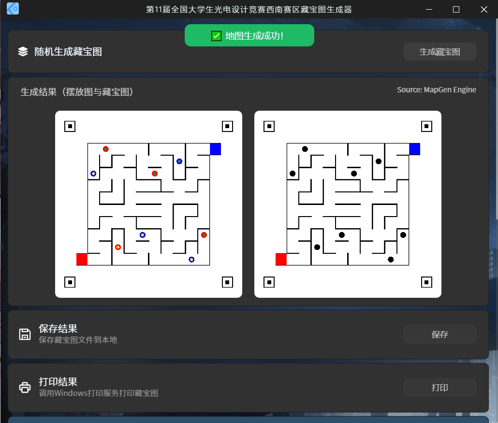

<h1 align="center"> OPT Map Generator </h1>
<h3 align="center"> 11th OPT Competition Map Generator based on Electron.</h3>
 

---

### 基于`Electron`框架的第十一届全国大学生光电设计竞赛小车迷宫生成客户端
### 本程序生成引擎基于西南赛区当前地图生成规则设计

## 🎰 支持功能：
- [x] 根据比赛规则自动生成场地摆放参考图与藏宝图
- [x] 一键打印藏宝图为PDF或通过打印机打印藏宝图
- [x] 一键保存参考图与藏宝图文件至本地
- [ ] 一键批量生成藏宝图

## 📥下载：
本项目提供Windows x64 可执行安装程序，并为不方便安装的用户提供免安装版本，免安装版本为压缩包，解压后即可使用。

稳定版：[Release Download](https://github.com/JimHans/OPTMapGenerator/releases/latest)

## 💻软件截图：

## 🧡感谢：

本项目由UESTC × AEA 联合开发

This Program is open sourced under the GPL v3.0 license.

本程序基于 GPL v3.0 License 开源，不得用于商业用途